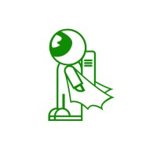

```markdown
<div align="center">
  
  <h1>LeadDesk Mini</h1>
  <p>A production-ready, highly optimized lead capture and management dashboard built with Next.js 15, MongoDB, and NextAuth v5.</p>
</div>

---

## Premium Features

- **Public Lead Capture:** Clean, responsive landing page to collect names, emails, budgets, and project details.
- **Robust Validation:** Client and server-side data integrity using Zod and React Hook Form.
- **Edge-Optimized Authentication:** Lightning-fast, database-free NextAuth (Auth.js v5) login flow using environment variables to completely prevent Vercel Edge Runtime crashes.
- **Protected Dashboard:** Next.js middleware-secured admin route (`/admin`) restricting unauthorized access.
- **Modular Dashboard UI:** Separated components for search, data tables, and client-side pagination.
- **Premium UI Enhancements:** 
  - GSAP-animated responsive navigation header.
  - Seamless system/manual dark mode toggling.
  - Shimmer loading animations and password visibility toggles on the login screen.
  - Custom sleek scrollbar.

## Tech Stack

- **Framework:** Next.js 15 (App Router)
- **Styling:** Tailwind CSS v4, Lucide React Icons
- **Database:** MongoDB Atlas, Mongoose
- **Authentication:** NextAuth.js v5 (Credentials Provider)
- **Validation:** React Hook Form, Zod

## Folder Structure

```text
├── app/
│   ├── admin/          # Protected dashboard routes
│   ├── api/            # Route handlers (auth, leads, seed)
│   ├── login/          # Public authentication page
│   ├── layout.js       # Global layout & NextThemes wrapper
│   └── page.js         # Public landing page (Lead Capture form)
├── components/         # Reusable UI (Header, Forms, Dashboard, Pagination)
├── lib/                # Database connection & validation schemas
├── models/             # Mongoose schemas (Lead, User)
├── public/assets/      # Static images and logos
├── auth.js             # NextAuth v5 core configuration (Edge safe)
└── middleware.js       # Route protection logic

```

## Setup Instructions

### 1. Installation

Clone the repository and install all dependencies:

```bash
npm install

```

### 2. Environment Variables

Create a `.env.local` file in the root directory.

```env
# Database Connection
MONGODB_URI=mongodb+srv://<user>:<password>@cluster.mongodb.net/leaddesk

# NextAuth v5 (Auth.js) Configuration
# Generate a secret via terminal: npx auth secret
AUTH_SECRET=your_super_secret_random_32_character_string
AUTH_URL=http://localhost:3000

# Admin Login Credentials
ADMIN_EMAIL=admin@digitalheroes.com
ADMIN_PASSWORD=securepassword123

```

### 3. Database Initialization (Seeding)

To initialize your database with the admin user, start your development server and simply visit the API endpoint in your browser:

1. Run `npm run dev`
2. Open: `http://localhost:3000/api/seed`
3. The API will safely hash your `.env` password and create the admin record in MongoDB.

### 4. Running Locally

Start the development server:

```bash
npm run dev

```

Navigate to `http://localhost:3000` to view the public form, and `http://localhost:3000/login` to access the admin panel.

## Authentication Architecture

To ensure 100% compatibility with Vercel's Edge Runtime (used by Next.js Middleware), the login flow operates independently of MongoDB:

1. **Login:** NextAuth validates credentials directly against `ADMIN_EMAIL` and `ADMIN_PASSWORD` in your environment variables.
2. **Session:** A secure JWT cookie is generated and sent to the client.
3. **Protection:** `middleware.js` intercepts requests to `/admin` and verifies the JWT cookie. If invalid or missing, the user is redirected to `/login`.

## API Endpoints

* `POST /api/leads` - Validate and save a new project inquiry.
* `GET /api/leads` - Retrieve all leads (sorted by newest).
* `PATCH /api/leads/:id` - Update the status of a specific lead (New, Contacted, Closed).
* `GET /api/seed` - Initialize the MongoDB admin user.

## Deployment Instructions (Vercel)

1. Push your code to a GitHub repository.
2. Import the project into Vercel.
3. In the Vercel Dashboard, go to **Settings > Environment Variables** and add:
* `MONGODB_URI`
* `AUTH_SECRET`
* `AUTH_URL` (Set this to your live Vercel domain: `https://your-app.vercel.app`)
* `ADMIN_EMAIL`
* `ADMIN_PASSWORD`


4. Deploy the application.
5. Visit `https://your-app.vercel.app/api/seed` once to initialize the production database.

## Known Limitations

* No user registration system (designed strictly for a single owner/admin).
* Does not include email notifications for new lead submissions.


